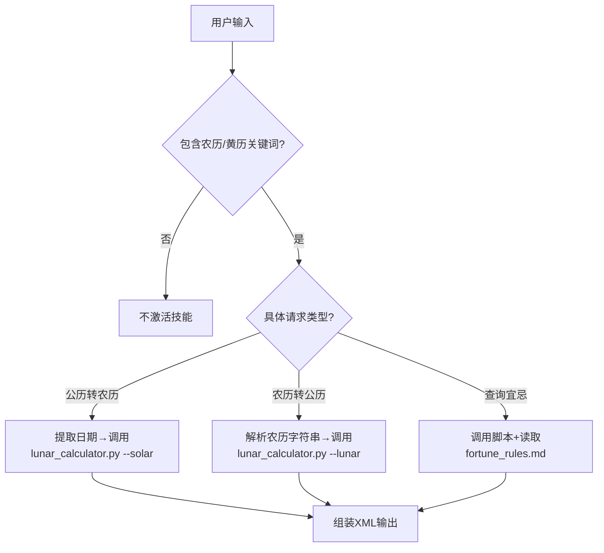

<skill_body>
## 🎯 Purpose
提供精确到秒级的中国传统农历（夏历）转换与查询服务。本技能是**确定性计算任务**，严禁依赖大模型内部参数化的农历记忆（该记忆存在闰月错位风险），必须通过脚本执行可靠算法。

## ⏰ When to Use
- ✅ 用户输入中包含"农历"、"阴历"、"黄历"、"宜忌"、"干支"、"生肖"、"节气"
- ✅ 需要将公历日期转换为"乙巳年、正月十五"等中式表述
- ✅ 需要判断某日是否"宜嫁娶"、"忌开市"
- ✅ 查询二十四节气的具体交节时刻
- ❌ 用户仅询问"今天是几号"（请留给通用对话能力）

## 🧠 Process (低自由度·严格模式)

### 步骤1：意图识别与参数提取
- 判断转换方向：`公历→农历` / `农历→公历` / `宜忌查询`
- 提取核心参数：
  - 公历日期（如 `2026-02-13`）
  - 农历表述（如 `二零二六年腊月廿三`、`闰七月`）
  - 具体需求（仅日历/仅宜忌/详细解读）

### 步骤2：调用专用脚本（严禁自行编写）
<critical_rule status="最高优先级">
你**不得**尝试用Python代码现场计算农历。农历涉及复杂置闰规则和定朔算法，运行时现场编写的代码存在计算错误风险。
你必须直接调用 `scripts/lunar_calculator.py`。
</critical_rule>

- 调用格式示例：
```bash
python scripts/lunar_calculator.py --solar 2026-02-13
python scripts/lunar_calculator.py --lunar "2026-07-23" --leap false
python scripts/lunar_calculator.py --solar 2026-02-13 --with-fortune true
```

### 步骤3：按需加载参考资源
- 如需输出"详细宜忌解读"，必须先读取 references/fortune_rules.md
- 如需解释"节气原理"，读取 references/solar_terms.md
- 严禁将上述Reference全文塞入上下文，仅读取所需章节。

### 步骤4：结构化组装输出
强制使用以下固定模板，禁止自由发挥格式：
```xml
<lunar_query_result>
<solar_date>{{输入或计算出的公历日期}}</solar_date>
<lunar_date>
  <year>{{干支年}}（{{生肖}}）</year>
  <month>{{农历月}}{{闰月标识}}</month>
  <day>{{农历日}}</day>
  <festival>{{若有传统节日}}</festival>
</lunar_date>
<solar_term>{{节气名称}}（{{交节时间}}）</solar_term>
<fortune>
  <suitable>{{宜：条目1、条目2}}</suitable>
  <avoid>{{忌：条目1、条目2}}</avoid>
</fortune>
</lunar_query_result>
```

## 🔍 Decision Logic


## ⚠️ Constraints（防走偏）
1. 禁用模糊表述：如"大概是"、"我记得农历好像是"。农历是精确历法，必须输出确定结果。
2. 闰月处理：输出农历月时必须显式标注"闰"字（如"闰七月"），脚本已内置判别逻辑。
3. 时间范围：本技能支持1900-2100年（脚本算法覆盖范围），超出需提示用户。
4. 黄历输出：仅输出传统历书规定的宜忌项，不添加现代演绎内容（如"宜发朋友圈"）。
</skill_body>